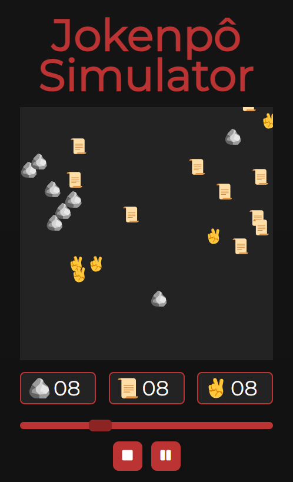
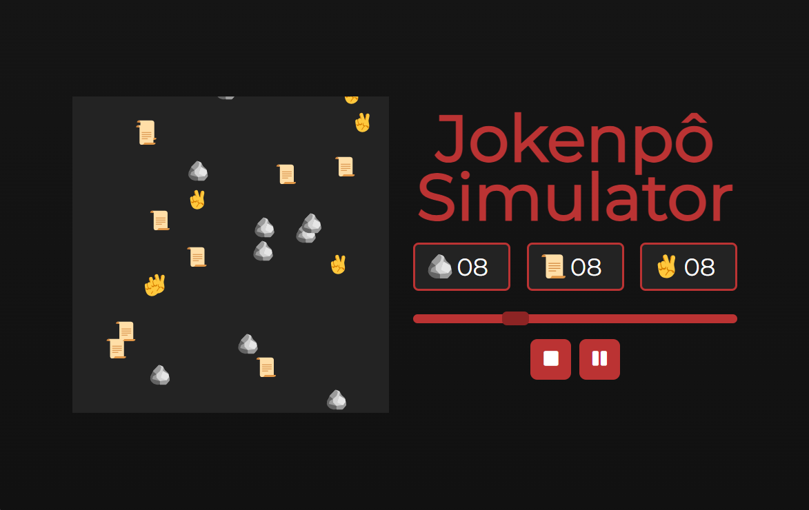

# Jokenpô Simulator

## Overview

Jokenpô Simulator is an experimental web application created for educational purposes. It simulates the game of Rock, Paper, Scissors, allowing users to adjust the quantity of each element (rock, paper, scissors), control the speed of the simulation, and start, stop, or pause the animation.

## Preview

### Mobile Version

### Desktop Version

## Access

You can access the live version of the project [here](https://jokenpo-simulator.vercel.app).

⚠️ **Please Note:** This project is experimental and may contain bugs or unexpected behavior.

## Features

- Adjustable quantity of rocks, papers, and scissors.
- Control the speed of the simulation.
- Start, stop, and pause the animation.
- Responsive design for various screen sizes.

## Technologies Used

- HTML
- CSS
- JavaScript
